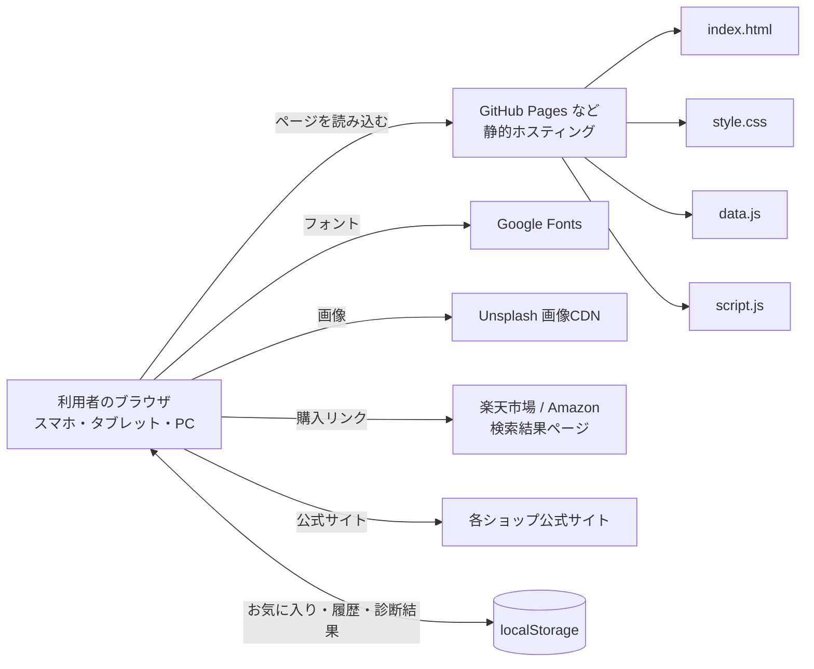
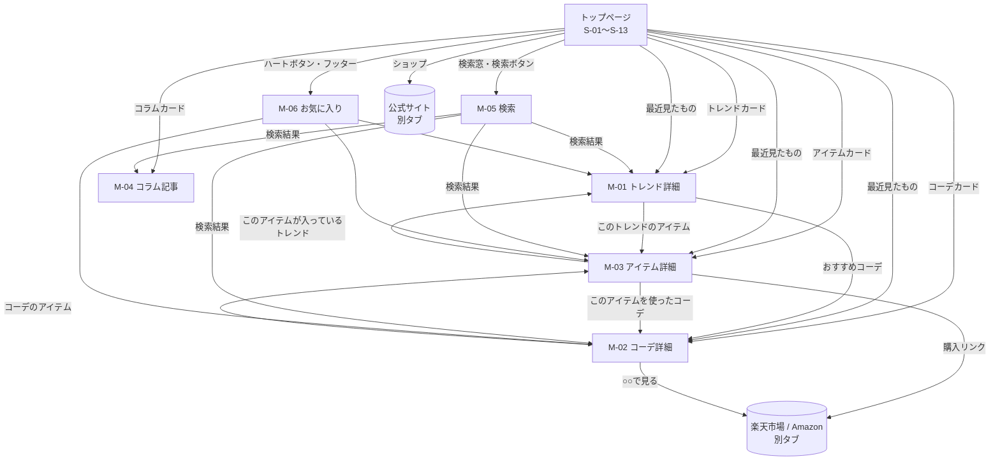
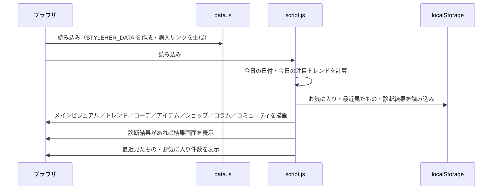
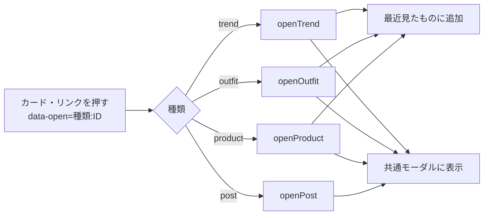
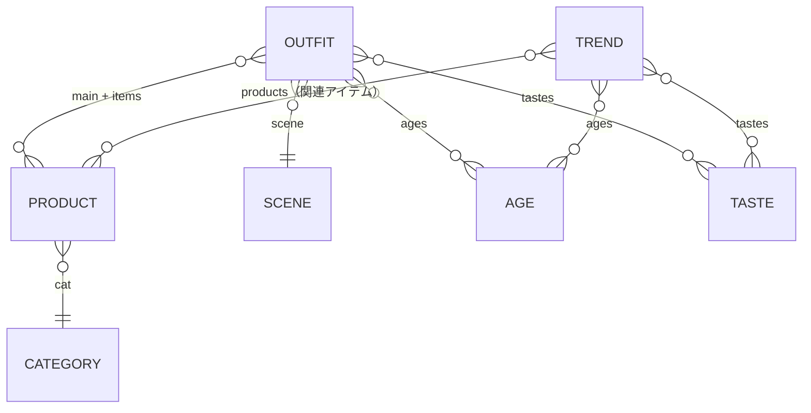

# 設計書（基本設計・詳細設計）

**プロジェクト名（仮）：** ファッショントレンド・コーディネート支援Webアプリ「StyleHer（スタイルハー）」
**作成日：** 2026年9月18日
**版数：** v0.1（初版）
**関連文書：** [プロジェクト仕様書・要件定義 v0.2](プロジェクト仕様書_要件定義.md)

---

## 1. 本書の目的と範囲

本書は、「プロジェクト仕様書・要件定義 v0.2」で定めた機能（F-01〜F-20）を、**どのような構成・画面・データ・処理で実現するか** をまとめた設計書である。

- 対象：MVP（優先度 高・中・低）の機能
- 対象外：仕様書で「対象外」とした F-21〜F-26（会員登録、管理画面、コミュニティ、AIコーデ提案、外部診断連携、アプリ内決済）。ただし将来の拡張を見すえた方針は「12. 今後の拡張に向けた設計方針」に記載する。

---

## 2. システム構成

### 2.1 構成の方針

MVPでは **サーバーを持たない静的Webサイト** として作る。理由は次のとおり。

| 方針 | 理由 |
|---|---|
| HTML / CSS / JavaScript のみで作る（フレームワークなし） | ビルド作業が不要で、ファイルを置くだけで公開・更新できる |
| データは JavaScript ファイル（`data.js`）に持つ | 管理画面（F-22）を作らずに、ファイルの書き換えだけで毎日の更新（F-15）ができる |
| お気に入り・閲覧履歴・診断結果はブラウザ（localStorage）に保存 | 会員登録（F-21）なしで個人の情報を残せる。個人情報をサーバーに送らない |
| 購入はECサイトへのリンクで行う | アプリ内決済（F-26）を持たず、決済情報を扱わない |

### 2.2 全体構成図



### 2.3 ファイル構成

| ファイル | 役割 |
|---|---|
| `index.html` | ページの骨組み。各セクションの枠、共通モーダル、トースト、SVGアイコン定義（`<symbol>`）を持つ |
| `style.css` | デザイン（色・フォント・レイアウト）とレスポンシブ対応 |
| `data.js` | 表示するすべてのデータ（トレンド・コーデ・アイテム・コラム・ショップなど）。グローバル定数 `STYLEHER_DATA` として公開 |
| `script.js` | 画面の描画、絞り込み・検索・お気に入りなどの処理、イベント処理 |
| `プロジェクト仕様書_要件定義.md` | 要件定義書 |
| `設計書.md` | 本書 |

`data.js` → `script.js` の順に `defer` で読み込む。`script.js` は `STYLEHER_DATA` を前提に動作する。

### 2.4 外部サービス

| サービス | 用途 | 備考 |
|---|---|---|
| Google Fonts | Cormorant Garamond / Shippori Mincho / Zen Kaku Gothic New / Allura | 読み込めない場合はOS標準フォントで表示 |
| Unsplash | トレンド・コーデ・アイテム・コラムの画像 | 画像IDからURLを組み立てる（6.3参照） |
| 楽天市場・Amazon | 購入リンク（検索結果ページ） | 価格・在庫はリンク先で確認してもらう |
| 各ショップ公式サイト | ショップ一覧（F-17）のリンク先 | — |

---

## 3. 画面設計

### 3.1 画面の考え方

MVPは **1ページ構成（シングルページ）** とする。トップページを縦にスクロールして各機能のセクションを見てもらい、詳細は **共通モーダル** で表示する。ページ移動をなくすことで、すき間時間でもテンポよく見られるようにする（ペルソナA・B）。

### 3.2 画面一覧

| 画面ID | 画面・セクション | HTMLのid | 対応機能 |
|---|---|---|---|
| S-01 | ヘッダー（ロゴ・メニュー・検索・お気に入り） | `top` | F-12, F-13, F-14 |
| S-02 | メインビジュアル（スライド） | — | F-01, F-04（更新日表示） |
| S-03 | 4つの特徴 | — | F-01 |
| S-04 | 注目のトレンド | `trends` | F-02, F-04 |
| S-05 | かんたんスタイル診断 | `shindan` | F-16 |
| S-06 | シーン別コーデ | `outfits` | F-05, F-06 |
| S-07 | メッセージ（引用） | — | F-01 |
| S-08 | おすすめアイテム | `products` | F-08, F-11（着回し数バッジ） |
| S-09 | 人気ショップ | — | F-17 |
| S-10 | 最近見たもの | `recent` | F-19 |
| S-11 | コラム | `blog` | F-18 |
| S-12 | コミュニティ（告知のみ） | `community` | F-23（対象外・告知のみ） |
| S-13 | フッター（メールマガジン登録・SNS） | — | F-20 |
| M-01 | トレンド詳細モーダル | `modal` | F-03 |
| M-02 | コーデ詳細モーダル | `modal` | F-07 |
| M-03 | アイテム詳細モーダル | `modal` | F-09, F-10, F-11 |
| M-04 | コラム記事モーダル | `modal` | F-18 |
| M-05 | 検索モーダル | `modal` | F-12 |
| M-06 | お気に入り一覧モーダル | `modal` | F-13 |

### 3.3 画面遷移図



- モーダルからモーダルへの移動は、**同じモーダルの中身を差し替える** 方式とする（重ねて開かない）。
- 外部サイトはすべて **別タブ**（`target="_blank" rel="noopener"`）で開き、StyleHer の画面を残す。

### 3.4 共通モーダルの仕様

| 項目 | 仕様 |
|---|---|
| 開く | `openModal(html, kind)`。開く前にフォーカスしていた要素を覚えておく |
| 閉じる | 閉じるボタン・背景クリック・Escキー。閉じたら元の要素にフォーカスを戻す |
| スクロール | 開いている間は背景のスクロールを止める（`body.no-scroll`） |
| 初期フォーカス | 入力欄があれば入力欄、なければ閉じるボタン |
| 種類（kind） | `trend` / `outfit` / `product` / `post` / `search` / `favorites` |

### 3.5 各画面の表示項目

**S-04 注目のトレンド（トレンドカード）**
画像、「今日の注目」バッジ（該当時のみ）、注目度（%）、お気に入りボタン、トレンド名、サブタイトル、コーデ件数、シーズン

**S-06 シーン別コーデ（コーデカード）**
メイン画像、使用アイテムのサムネイル、タイトル、アイテム合計金額（「¥○○〜」）、お気に入りボタン

**S-08 おすすめアイテム（アイテムカード）**
画像、着回しバッジ（「着回し ○コーデ」、0件のときは出さない）、アイテム名、カテゴリー・カラー・ショップ、価格、お気に入りボタン、「購入する」ボタン

**M-01 トレンド詳細**
ギャラリー（最大4枚）、今日の注目表示、名前、サブタイトル、説明、注目度（メーター）、シーズン、おすすめ年代、ポイント、着こなしと着回しのコツ、お気に入りボタン、このトレンドのアイテム、おすすめコーデ（最大3件）

**M-02 コーデ詳細**
メイン画像とアイテム画像、シーン、タイトル、説明、アイテム合計、テイスト、おすすめ年代、着こなしのコツ、コーデのアイテム（購入リンク付き）、お気に入りボタン

**M-03 アイテム詳細**
画像、カテゴリー、名前、参考価格、カラー、着回し数、ショップ比較ボタン（楽天市場・Amazon）、注意書き、このアイテムが入っているトレンド、このアイテムを使ったコーデ一覧、お気に入りボタン

---

## 4. 機能設計

### 4.1 機能と実装の対応

| ID | 機能 | 主な関数・処理（`script.js`） |
|---|---|---|
| F-01 | トップページ | 初期化処理で各セクションを描画（`renderHero` ほか） |
| F-02 | トレンド一覧 | `renderTrendFilter`, `renderTrends`, `trendCard` |
| F-03 | トレンド詳細 | `openTrend` |
| F-04 | 今日の注目トレンド | `todayTrendIndex`, `trendsToday` |
| F-05 | シーン別コーデ一覧 | `renderOutfitControls`, `renderOutfits`, `outfitCard` |
| F-06 | コーデの絞り込み | `outfitState` と各イベント処理 |
| F-07 | コーデ詳細 | `openOutfit`, `outfitPrice` |
| F-08 | アイテム一覧 | `renderProductControls`, `renderProducts`, `productState` |
| F-09 | アイテム詳細 | `openProduct` |
| F-10 | 購入リンク（ショップ比較） | `data.js` の購入リンク生成、`openProduct` のショップボタン |
| F-11 | 着回し提案 | `outfitItems`, `outfitsWith`, `wearCount` |
| F-12 | キーワード検索 | `plain`, `search`, `renderSearchResults`, `openSearch` |
| F-13 | お気に入り | `favs`, `toggleFav`, `renderFavorites`, `updateFavCount` |
| F-14 | スマートフォン対応 | `style.css` のメディアクエリ、`setMenu`（スマホ用メニュー） |
| F-15 | コンテンツ更新 | `data.js` の書き換え（10章の運用手順） |
| F-16 | かんたんスタイル診断 | `answer`, `recommend`, `showShindanResult`, `resetShindan` |
| F-17 | ショップ一覧 | `renderShops` |
| F-18 | コラム | `renderPosts`, `openPost` |
| F-19 | 最近見たもの | `addRecent`, `renderRecent` |
| F-20 | メールマガジン登録 | `#newsForm` の送信処理 |

### 4.2 今日の注目トレンド（F-04）

日付をもとに、毎日自動で「今日の注目」を切り替える。データを書き換えなくても、毎日違うトレンドが先頭に来る。

```
日数 = 1970年1月1日からの経過日数（今日の日付をUTCで計算）
今日の注目 = trends[ 日数 % トレンドの件数 ]
表示順   = 今日の注目から始めて、元の並び順で一周させる
```

- トレンドカードには「今日の注目」バッジ、詳細には「TREND · 今日の注目」と表示する。
- メインビジュアルとトレンド見出しに「2026年9月18日(金) 更新」の形式で今日の日付を表示する。

### 4.3 絞り込み・並び替え

**トレンド一覧（F-02）**

| 条件 | 選択肢 | 判定 |
|---|---|---|
| 年代 | すべて / 20代 / 30代 / 40代 | トレンドの `ages` に含まれるか |

**シーン別コーデ（F-05・F-06）**

| 条件 | 選択肢 | 判定 |
|---|---|---|
| シーン | 通勤 / 休日 / デート / お呼ばれ / 旅行 / おうち時間（初期値：通勤） | コーデの `scene` と一致するか |
| 年代 | すべて / 20代 / 30代 / 40代 | コーデの `ages` に含まれるか |
| テイスト | すべて / きれいめ / カジュアル / フェミニン / ナチュラル / シンプル | コーデの `tastes` に含まれるか |

- 「すべて見る」ボタンで、シーン・年代・テイストをすべて「すべて」に戻す。
- 条件は AND（すべて満たすもの）で絞り込む。0件のときは「条件に合うコーデがありません。年代やテイストを変えてみてください。」と表示する。

**アイテム一覧（F-08）**

| 条件 | 選択肢 | 判定 |
|---|---|---|
| カテゴリー | すべて / トップス / アウター / ボトムス / ワンピース / シューズ / バッグ / アクセサリー | `cat` と一致 |
| カラー | すべて + データ中のカラー（重複を除いて自動生成） | `color` と一致 |
| 価格帯 | すべて / 〜¥2,999 / ¥3,000〜¥6,999 / ¥7,000〜（値は `0-2999` のような `最小-最大` 形式） | `最小 ≦ price ≦ 最大` |
| 並び替え | おすすめ順（データの並び）/ 価格が安い順 / 価格が高い順 / 着回しできる順（着回し数の多い順） | — |

- 表示は **10件ずつ**。「もっと見る（残り○件）」で10件ずつ追加する。条件を変えたら10件に戻す。

### 4.4 着回し提案（F-11）

コーデで使われているアイテムを数えて、「そのアイテムで何通りのコーデができるか」を出す。

```
コーデのアイテム = main（写真の主役アイテム。ある場合のみ） + items（サムネイルに出すアイテム）
着回し数(アイテムX) = 「コーデのアイテム」に X を含むコーデの件数
```

- `main` はサムネイルには出さないが、着回し数とコーデの合計金額には含める。
- 表示場所：アイテムカードのバッジ、アイテム詳細の「着回し」と「このアイテムを使ったコーデ」、並び替え「着回しできる順」。

### 4.5 コーデの合計金額（F-07）

```
合計金額 = 「コーデのアイテム」の price の合計
```

参考価格の合計なので、一覧では「¥○○〜」と表示する。

### 4.6 購入リンク・ショップ比較（F-10）

各アイテムは検索キーワード `q` を持ち、`data.js` の読み込み時に次の2つのリンクを自動で作る。

| ショップ | URL |
|---|---|
| 楽天市場 | `https://search.rakuten.co.jp/search/mall/{q}/` |
| Amazon | `https://www.amazon.co.jp/s?k={q}` |

- `q` は `encodeURIComponent` でURLに使える形に変換する。
- アイテムの `shop`（おすすめのショップ）を **先頭** に並べ、先頭のリンクを「購入する」ボタンのリンク（`url`）にする。
- アイテム詳細では、先頭を濃い色のボタン、ほかを枠線のボタンで表示し、「各ショップの検索結果ページが開きます。価格や在庫はショップでご確認ください。」と注意書きを出す。

### 4.7 キーワード検索（F-12）

**表記ゆれへの対応（正規化）**

入力されたキーワードと検索対象の文字を、次の手順で同じ形にそろえてから比べる。

1. `NFKC` 正規化（全角英数字 → 半角、半角カナ → 全角カナ など）
2. 英字を小文字にする
3. カタカナをひらがなにする（例：「ニット」→「にっと」）

**検索のしかた**

- キーワードをスペースで区切り、**すべての語を含むもの**（AND検索）を探す。
- 入力するたびに結果を更新する（入力途中でも結果が変わる）。
- 何も入力していないときは「人気のキーワード」（きれいめ・通勤・ワンピース・ブラウン・ニット・お呼ばれ）を表示し、押すとその語で検索する。

**検索対象**

| 種類 | 検索する項目 |
|---|---|
| トレンド | 名前、サブタイトル、説明、ポイント、シーズン |
| コーデ | タイトル、説明、シーン名、テイスト名 |
| アイテム | 名前、カラー、カテゴリー名、ショップ |
| コラム | タイトル、概要、タグ、本文 |
| ショップ | 名前、種類 |

結果は種類ごとにまとめて件数と一緒に表示する。0件のときは「「○○」に一致する結果がありません。別のキーワードでお試しください。」と表示する。

### 4.8 お気に入り（F-13）

- 対象：トレンド・コーデ・アイテムの3種類。
- ハートボタンを押すたびに「追加 ⇔ 削除」を切り替え、トースト（「お気に入りに追加しました」など）で知らせる。
- 同じ対象のハートボタンが画面に複数あるときは、**すべてのボタンの表示を同時に更新** する（`data-fav="種類:ID"` で探す）。
- ヘッダーのハートにお気に入りの合計件数をバッジで出す（0件のときは隠す）。
- お気に入り一覧（M-06）では種類ごとに表示し、その場でハートを押して削除できる。
- データから消えたIDが保存されていても、一覧には出さない（エラーにしない）。

### 4.9 かんたんスタイル診断（F-16）

**質問**

| 質問 | 選び方 |
|---|---|
| Q1. 年代 | 20代 / 30代 / 40代 から1つ |
| Q2. 好きなテイスト | 5つの中から **2つまで**（1つ目に選んだものを重視）。3つ目を選ぼうとすると「テイストは2つまで選べます」と表示 |
| Q3. よく着るシーン | 6つのシーンから1つ |

3問すべてに答えていないときは「3つの質問すべてに答えてください」と表示し、結果を出さない。

**おすすめの決め方（点数方式）**

| 対象 | 点数の付け方 | 表示件数 |
|---|---|---|
| トレンド | 年代が合う：+2点、1つ目のテイストが合う：+4点、2つ目のテイストが合う：+2点 | 上位2件 |
| コーデ | シーンが合う：+4点、年代が合う：+2点、1つ目のテイストが合う：+2点、2つ目のテイストが合う：+1点 | 上位4件 |

- 0点のものは出さない。同じ点数のときはデータの並び順を優先する。
- 結果には「あなたは『きれいめ×シンプル』タイプ」のようなタイプ名と、1つ目のテイストに合わせた説明文を出す。

**結果画面のボタン**

- 「この条件でコーデを見る」：シーン別コーデ（S-06）の条件を診断結果（シーン・年代・テイスト）に合わせてスクロールする。選んだテイストで0件になる場合は、もう一方のテイスト、それでも0件なら「すべて」にする。
- 「もう一度診断する」：回答と保存した結果を消して、質問画面に戻す。

**保存**

結果は localStorage に保存し、次に開いたときは結果画面から表示する。保存された年代・シーンがデータに存在しない場合は質問画面を出す。

### 4.10 最近見たもの（F-19）

- トレンド・コーデ・アイテムの詳細を開いたときに記録する（コラムは記録しない）。
- 新しいものを先頭に追加し、同じものは先頭に移動する。**最大8件**。
- 1件もないときはセクションごと隠す。「履歴を消す」ですべて消す。

### 4.11 メールマガジン登録（F-20）

- MVPでは **形式チェックのみ** 行い、どこにも送信しない。
- チェック：`文字@文字.文字` の形（空白を含まない）であること。
- 正しいとき：「ご登録ありがとうございます！（デモ版のため実際には送信されません）」と表示し、入力欄を空にする。
- 正しくないとき：「メールアドレスの形式が正しくありません。」を赤字で表示する。

### 4.12 メインビジュアル

- 3枚のスライドを **6秒ごと** に自動で切り替える。
- 前へ・次へボタン、ドットで手動切り替えができる。手動で切り替えた後は、次の自動切り替えまでを **9秒** にする。
- 1枚目以外の画像は遅延読み込みにする。

### 4.13 スマートフォン用メニュー・ナビゲーション（F-14）

- 画面が狭いときはメニューをハンバーガーボタンで開閉する。メニュー内のリンクを押したら閉じる。
- 画面中央付近に表示されているセクションに合わせて、メニューの該当項目を強調する（`IntersectionObserver`）。ページ上部（300px未満）では「ホーム」を強調する。

### 4.14 コミュニティ（対象外機能の告知）

F-23 はMVPの対象外のため、ギャラリー画像の表示のみ行う。「参加する」ボタンは「コミュニティ機能は近日公開予定です。ページ下部のメール登録でお知らせします！」とトーストで知らせる。

---

## 5. 処理フロー

### 5.1 初期表示



### 5.2 カードを押して詳細を開く



- クリックは `document` でまとめて受け取り、`data-fav` → `data-close` → `data-suggest` → `data-open` → `data-open-favs` の順に判定する。
- カード（`role="button"`）はキーボードの Enter / Space でも開ける。

---

## 6. データ設計

### 6.1 データの全体像



`data.js` の `STYLEHER_DATA` は次のデータを持つ。

| キー | 内容 | 件数（v0.2時点） |
|---|---|---|
| `scenes` | シーン | 6 |
| `ages` | 年代 | 3 |
| `tastes` | テイスト | 5 |
| `categories` | アイテムのカテゴリー（「すべて」を含む） | 8 |
| `products` | アイテム | 25 |
| `trends` | トレンド | 6 |
| `outfits` | コーデ | 25 |
| `shops` | ショップ | 9 |
| `posts` | コラム | 4 |
| `community` | コミュニティのギャラリー画像ID | 8 |
| `heroSlides` | メインビジュアルのスライド | 3 |

### 6.2 各データの項目

**マスタ（scenes / ages / tastes / categories）**

| 項目 | 型 | 説明 | 例 |
|---|---|---|---|
| `id` | 文字列 | ID | `tsukin`, `20s`, `kireime`, `tops` |
| `name` | 文字列 | 表示名 | 通勤、20代、きれいめ、トップス |
| `icon` | 文字列 | アイコン名（scenes のみ）。`index.html` の `#i-{icon}` を使う | `briefcase` |

**アイテム（products）**

| 項目 | 型 | 必須 | 説明 |
|---|---|---|---|
| `id` | 文字列 | ○ | `p01` 形式 |
| `name` | 文字列 | ○ | アイテム名 |
| `cat` | 文字列 | ○ | カテゴリーID |
| `color` | 文字列 | ○ | カラー（表示名。カラーの絞り込み選択肢にもなる） |
| `price` | 数値 | ○ | 参考価格（円・税込） |
| `shop` | 文字列 | ○ | おすすめのショップ（`楽天市場` または `Amazon`） |
| `img` | 文字列 | ○ | 画像ID または画像パス（6.3参照） |
| `q` | 文字列 | ○ | ECサイトでの検索キーワード |
| `links` | 配列 | 自動 | `{ shop, url }` の配列（4.6参照。データには書かない） |
| `url` | 文字列 | 自動 | 「購入する」ボタンのリンク（`links` の先頭） |

**トレンド（trends）**

| 項目 | 型 | 必須 | 説明 |
|---|---|---|---|
| `id` | 文字列 | ○ | 英字のID（例：`kireime`, `brown`） |
| `name` / `sub` | 文字列 | ○ | 名前 / サブタイトル |
| `img` | 文字列 | ○ | メイン画像 |
| `gallery` | 文字列配列 | ○ | 詳細で出す追加画像（3枚まで表示） |
| `hot` | 数値 | ○ | 注目度（0〜100） |
| `season` | 文字列 | ○ | 旬の時期（例：`2026秋冬`、`通年`） |
| `posts` | 数値 | ○ | コーデ件数（表示用） |
| `ages` / `tastes` | 文字列配列 | ○ | 対象の年代ID / テイストID |
| `desc` | 文字列 | ○ | 説明 |
| `points` / `tips` | 文字列配列 | ○ | ポイント / 着こなしと着回しのコツ |
| `products` | 文字列配列 | ○ | 関連アイテムのID |

**コーデ（outfits）**

| 項目 | 型 | 必須 | 説明 |
|---|---|---|---|
| `id` | 文字列 | ○ | `o01` 形式 |
| `scene` | 文字列 | ○ | シーンID |
| `title` | 文字列 | ○ | タイトル |
| `img` | 文字列 | ○ | コーデ画像 |
| `main` | 文字列 | — | 写真の主役アイテムのID（サムネイルに出さないが、着回し数・合計金額に含める） |
| `items` | 文字列配列 | ○ | サムネイルに出すアイテムのID（3件を推奨） |
| `ages` / `tastes` | 文字列配列 | ○ | 対象の年代ID / テイストID |
| `desc` | 文字列 | ○ | 説明 |
| `tips` | 文字列配列 | ○ | 着こなしのコツ |

**ショップ（shops）**：`name`（名前）、`url`（公式サイト）、`type`（種類。例：プチプラ、総合通販）

**コラム（posts）**：`id`（`a01` 形式）、`title`、`tag`（トレンド / 通勤 / 着回し / 季節のコツ など）、`date`（`YYYY-MM-DD`）、`img`、`excerpt`（概要）、`body`（段落の配列）

**メインビジュアル（heroSlides）**：`img`、`pos`（画像の表示位置。省略時 `center 30%`）、`title`（`<br>` で改行可）、`text`

### 6.3 画像の指定ルール

`img` には次のどちらかを入れる。

| 書き方 | 例 | 使われるURL |
|---|---|---|
| Unsplash の画像ID | `1603252109303-2751441dd157` | `https://images.unsplash.com/photo-{ID}?w=…&h=…&fit=crop&auto=format&q=70` |
| 自分の画像のパス（`/` か `.` を含む） | `images/shirt.jpg` | そのまま使う |

表示サイズ（幅・高さ）は画面ごとに `script.js` 側で指定し、必要な大きさの画像だけを読み込む。

### 6.4 データの整合性ルール

- `outfits` の `scene`・`ages`・`tastes`、`trends` の `ages`・`tastes`、`products` の `cat` は、各マスタに存在するIDを使う。
- `trends.products`・`outfits.main`・`outfits.items` は、`products` に存在するIDを使う（存在しないIDがあると表示時にエラーになる）。
- IDは重複させない。一度公開したIDは変えない（お気に入り・閲覧履歴がIDで保存されているため）。

---

## 7. ブラウザ保存（localStorage）設計

| キー | 内容 | 形式 | 例 |
|---|---|---|---|
| `styleher:favorites` | お気に入り | `{ trend: ID[], outfit: ID[], product: ID[] }` | `{"trend":["brown"],"outfit":["o01"],"product":["p07"]}` |
| `styleher:recent` | 最近見たもの（新しい順・最大8件） | `"種類:ID"` の配列 | `["product:p07","trend:brown"]` |
| `styleher:profile` | スタイル診断の結果 | `{ age, tastes: ID[], scene }` または `null` | `{"age":"30s","tastes":["kireime"],"scene":"tsukin"}` |

- 読み書きはすべて `try/catch` で囲む。プライベートブラウズなどで localStorage が使えない場合も **エラーにせず**、表示中はメモリ上で動かす。
- 保存するのはIDと選択肢のみ。名前・メールアドレスなどの個人情報は保存しない。
- 保存されたIDがデータから消えていても、表示時に読み飛ばす。

---

## 8. デザイン・UI設計

### 8.1 デザインの方向性

「上品・やさしい・大人っぽい」を軸に、ベージュ〜ローズ系のくすみカラーと明朝体の見出しで、ファッション誌のような雰囲気にする。

### 8.2 カラー

| 変数 | 値 | 用途 |
|---|---|---|
| `--bg` | `#faf6f3` | ページ背景 |
| `--surface` | `#ffffff` | カード・モーダル |
| `--soft` | `#f5ece7` | 淡い背景 |
| `--blush` | `#efdcd5` | アクセント背景 |
| `--line` | `#ece1db` | 区切り線 |
| `--text` | `#2b2321` | 本文 |
| `--muted` | `#8b7b76` | 補足文字 |
| `--accent` | `#b0707a` | アクセント（ハート・強調） |
| `--accent-soft` | `#f6e4e6` | アクセントの淡い色 |
| `--dark` | `#221c1b` | 濃いボタン |

### 8.3 フォント

| 変数 | フォント | 用途 |
|---|---|---|
| `--serif` | Cormorant Garamond、Shippori Mincho | 見出し・ロゴ |
| `--sans` | Zen Kaku Gothic New（なければヒラギノ角ゴ・Noto Sans JP など） | 本文 |
| `--script` | Allura | 装飾の英文字 |

### 8.4 レスポンシブ（F-14）

| 画面幅 | 想定端末 | 主な変化 |
|---|---|---|
| 1101px以上 | PC | 基本のレイアウト |
| 〜1100px | 小さめのPC・タブレット横 | カードの列数を減らす |
| 〜900px | タブレット | ヘッダーを低く（72px → 62px）、メニューをハンバーガーに |
| 〜640px | スマートフォン | 1〜2列表示、余白・文字サイズを調整 |

### 8.5 共通パーツ

| パーツ | 説明 |
|---|---|
| チップ（`.chip`） | 絞り込みの選択肢。選択中は `aria-pressed="true"` |
| ハートボタン（`.heart`） | お気に入りの追加・削除 |
| トースト（`#toast`） | 操作結果を画面下に2.6秒表示 |
| 結果リスト（`.result-item`） | 検索・お気に入り・最近見たもの・おすすめで共通の横長リスト |
| アイコン | `index.html` の SVG `<symbol id="i-○○">` を `<use>` で使う |

---

## 9. 非機能設計

### 9.1 アクセシビリティ

- カード型のリンクには `role="button"`・`tabindex="0"`・`aria-label` を付け、キーボードで操作できるようにする。
- モーダルは `role="dialog"`・`aria-modal="true"`・`aria-labelledby` を付け、閉じたらフォーカスを元に戻す。
- 選択状態は `aria-pressed` / `aria-selected`、メニューの開閉は `aria-expanded` で伝える。
- トーストは `aria-live="polite"` で読み上げる。
- 動きを減らす設定（`prefers-reduced-motion`）のときは、アニメーションとスムーズスクロールを止める。

### 9.2 表示速度

- 画面外の画像は `loading="lazy"` で後から読み込む。
- Unsplash の画像は表示サイズに合わせて縮小・トリミングしたものを取得する。
- フレームワークを使わず、読み込むファイルを最小限にする。

### 9.3 セキュリティ・プライバシー

| リスク | 対策 |
|---|---|
| データや検索語による HTML の埋め込み（XSS） | 画面に出す文字は `esc()` で `& < > " '` を変換してから表示する。検索キーワードも同様 |
| 外部リンクからの元ページ操作 | 外部リンクはすべて `rel="noopener"` を付けて別タブで開く |
| 個人情報の送信 | サーバー送信を行わない。メールアドレスは形式チェックのみで保存・送信しない |
| 決済情報 | 扱わない（購入はECサイトで行う） |

※ `heroSlides.title` は改行（`<br>`）のために HTML として表示する。データの作成者（運営者）以外が書き換えない前提とする。

### 9.4 対応ブラウザ

最新版の Chrome / Safari（iOS・macOS）/ Edge / Firefox。`IntersectionObserver`、`String.prototype.normalize`、CSS変数など、現在の主要ブラウザで使える機能を前提とする。

---

## 10. 運用設計（コンテンツ更新・F-15）

### 10.1 毎日の更新手順

1. `data.js` を開き、必要なデータを追加・修正する（例：新しいトレンド、コーデ、アイテム、コラム）。
2. 6.4 の整合性ルールを確認する（IDの重複・存在しないIDの参照がないか）。
3. ブラウザで `index.html` を開き、表示・リンク・絞り込みを確認する。
4. Git でコミットして GitHub に push し、GitHub Pages に反映する。

### 10.2 更新時の注意

- 「今日の注目」は日付で自動的に切り替わるため、毎日データを変えなくても表示は変わる。
- 価格は参考価格として扱い、ECサイトの価格と大きくずれていないか定期的に確認する。
- 画像を差し替えるときは、利用条件（Unsplash のライセンス、または自社で権利を持つ画像）を確認する。
- 一度公開したIDは変更・再利用しない。

---

## 11. テスト観点

| # | 機能 | 確認すること |
|---|---|---|
| 1 | F-04 | 日付を変えると「今日の注目」と表示順が変わる／更新日が今日の日付になる |
| 2 | F-02 | 年代で絞り込める／0件のときにメッセージが出る |
| 3 | F-05・F-06 | シーン・年代・テイストの組み合わせで正しく絞り込める／「すべて見る」で元に戻る |
| 4 | F-07 | コーデの合計金額が `main` を含めたアイテム価格の合計と一致する |
| 5 | F-08 | カテゴリー・カラー・価格帯・並び替えが正しく動く／「もっと見る」で10件ずつ増える |
| 6 | F-10 | 楽天市場・Amazon のリンクが正しい検索キーワードで別タブに開く／おすすめショップが先頭 |
| 7 | F-11 | 着回し数がコーデ一覧の件数と一致する |
| 8 | F-12 | 「ニット」「にっと」「ﾆｯﾄ」で同じ結果になる／複数語でAND検索になる／`<script>` などを入力しても表示が崩れない |
| 9 | F-13 | 追加・削除が全カードに反映される／再読み込み後も残る／件数バッジが合っている |
| 10 | F-16 | 未回答では結果が出ない／テイストは2つまで／「この条件でコーデを見る」で0件にならない／再読み込み後も結果が残る |
| 11 | F-19 | 最大8件・新しい順・重複なし／「履歴を消す」で消える／コラムは記録されない |
| 12 | F-20 | 正しい形式・誤った形式でメッセージが切り替わる／送信されない |
| 13 | F-14 | 375px・768px・1280px の幅で表示が崩れない／スマホメニューが開閉できる |
| 14 | 共通 | Escキー・背景クリックでモーダルが閉じ、フォーカスが戻る／キーボードだけで主な操作ができる |
| 15 | 共通 | localStorage が使えない環境（プライベートブラウズ）でもエラーにならない |

---

## 12. 今後の拡張に向けた設計方針

| 拡張 | 方針 |
|---|---|
| 管理画面（F-22） | `data.js` の構造をそのままJSON（API）に置き換えられるようにしている。将来はCMSやデータベースから同じ形のデータを返す |
| 会員登録・ログイン（F-21） | localStorage のキーと形式（7章）をそのままサーバーに保存し、ログイン時に端末のお気に入りを引き継ぐ |
| 購入リンクの精度向上 | 検索結果ページへのリンクを、アフィリエイトAPIなどを使った商品ページへのリンクに置き換える（`links` の形式は変えない） |
| 画面の増加 | 1ページ構成で重くなった場合は、トレンド・コーデ・アイテムごとに個別ページ（URL）を持たせ、共有しやすくする |
| コミュニティ（F-23）・AIコーデ提案（F-24） | サーバーと認証が必要になるため、F-21 の実現後に設計する |

---

## 改訂履歴

| 版数 | 日付 | 内容 |
|---|---|---|
| v0.1 | 2026年9月18日 | 初版作成（要件定義 v0.2 と現在の実装にもとづく） |
